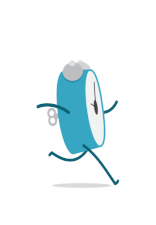
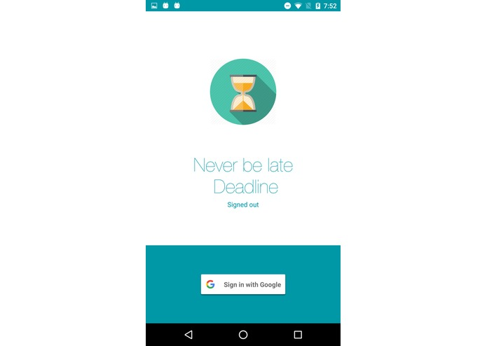
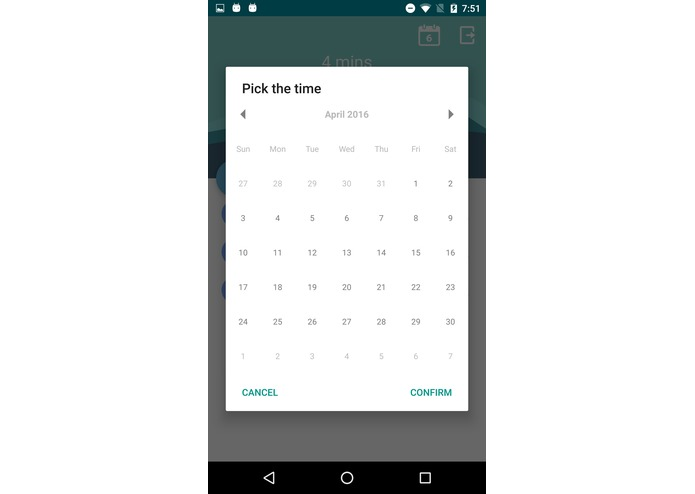
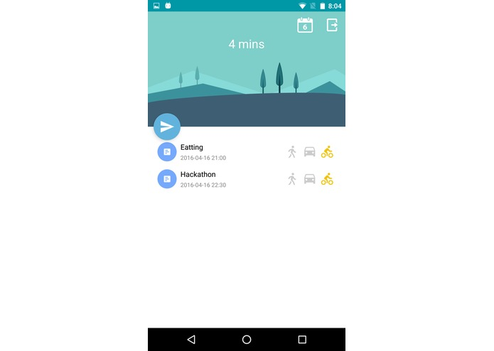

# 0Late
project for hackDay2016,An android app advanced google calendar's reminder function based on users' real time location.

# Inspiration
Has everybody used google calendar? It could notify us our daily event and manage our daily life well. However. Have you met this kind of situation? Like, yesterday I have a group meeting with my teammates. I almost forgot it until my google calendar sent a notification. As usual I set a 10-minutes-before notification for this event. So, when I noticed it, I only have 10 minutes to run to Sudikoff, and my home is out of town.

# What it does
Our app is ZeroLate, means never to be late, we could help users to set a more flexible deadline for each event. After logging your google account, ZeroLate could get all your events. And you could easily chose your transportation method, walking, driving or bicycling and our app will record your chose. Then we will start tracing the user’s location at 2 hours before the start time of first event. Then ZeroLate will compute user’s departure deadline based on google map’s estimated time in their transportation choice. This deadline will be showed on the first page. And user could receive a notification at this latest departure time.

# How we built it
We built it base on Android Studio platform. We take advantage of the Google Calendar and Google distance matrix api.

# What's next for 0Late
1.Enable operation of add/delete event 

2.Connect it with watch, and it will send notification to the watch when the final time for leaving is approaching 

3.Maybe share one's calendar events with others
